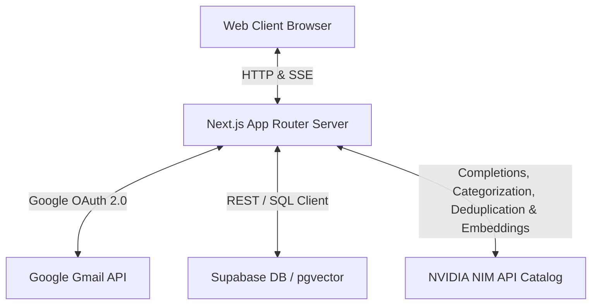
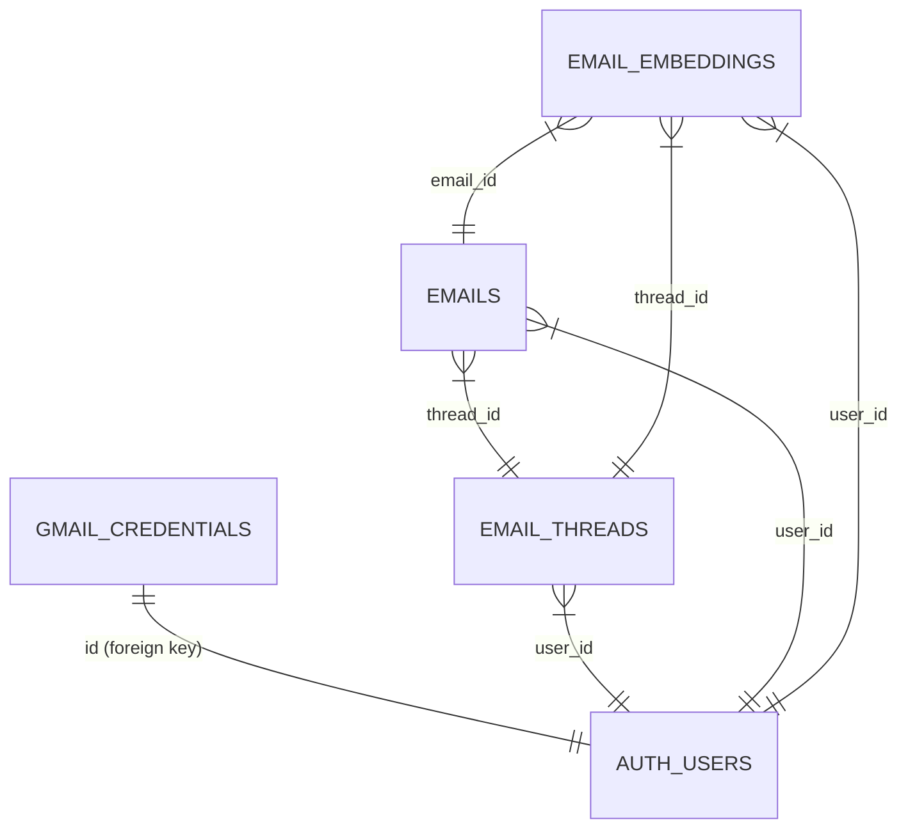
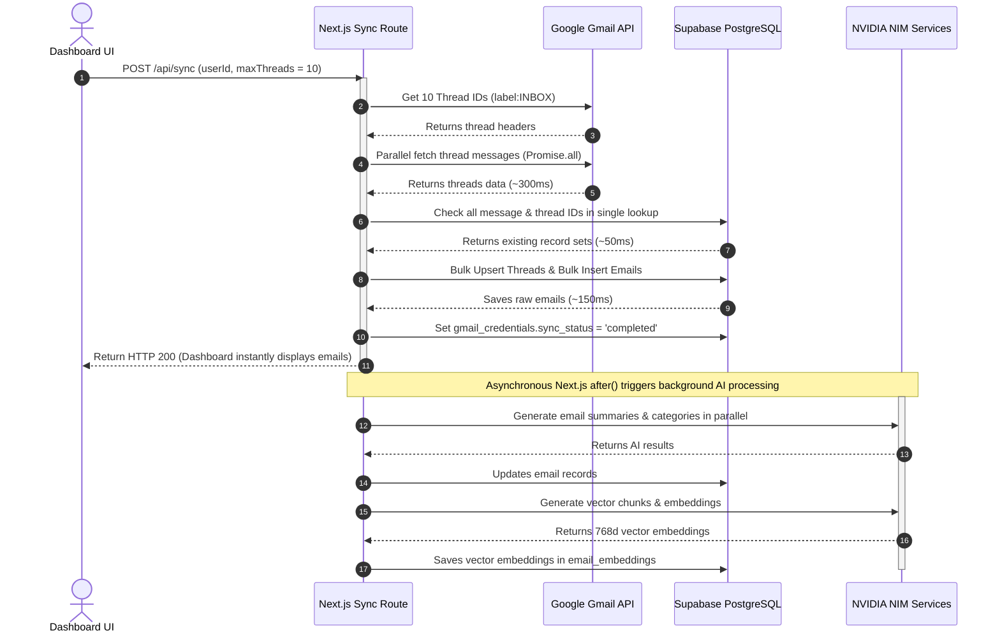

# System Architecture: Aether Gmail Intelligence Platform

This document describes the architectural layout, database models, AI processing decisions, and API strategies implemented in **Aether**.

---

## 1. System Architecture Diagram & Description

### Flow Breakdown
1. **Authentication Flow**: The user enters API configurations via the onboarding dashboard. Clicking "Connect Gmail" initiates a Google OAuth consent request. Google redirects the authorization code back to the backend, which exchanges it for access and refresh tokens, fetching the user's email address and storing the credentials in Supabase.
2. **Dynamic Multi-Account Support**: When onboarding, the browser generates a unique client-side UUID and stores it in `localStorage` under `aether_user_id`. When authentication completes, the database records the Google OAuth token under this UUID. This enables multiple accounts to connect without overwriting credentials, and ensures proper separation of email records.
3. **Fast Two-Phase Sync**: 
   - **Phase 1 (Raw Sync)**: The sync route pulls the newest 10 thread headers. It fetches all thread details in parallel via `Promise.all`. It queries for duplicates in a single database lookup and inserts all new threads and messages using bulk database operations. Once Phase 1 is done (typically in **~0.6 seconds**), it marks the status as `completed`, allowing the UI to immediately load the inbox.
   - **Phase 2 (Background AI Enrichment)**: Heavy processing tasks (generating Mistral summaries, NVIDIA NIM classifications, text chunking, and embedding generation) run asynchronously after the response is sent using Next.js 15's `after()` API.
4. **Conversational RAG Flow**: When a user queries the AI chat drawer, the query is parsed by Mistral to extract parameters (e.g., semantic topic, sender, date, category). The server queries Supabase via vector search and SQL filter fallback, merging results. The context is injected into Mistral's prompt, generating a response complete with clickable citation links to open specific threads.

---

## 2. Database Schema Design

The Supabase database consists of four normalized tables inside the `public` schema, all secured with PostgreSQL Row Level Security (RLS) to separate user data.

### Schema SQL Details
- **`gmail_credentials`**: Stores OAuth credentials securely. The `id` matches the unique client-side UUID so that credentials are tied to distinct browser sessions.
- **`email_threads`**: Represents email conversation threads. Contains `summary` generated by AI representing the full thread arc, and `last_message_at` for sorting.
- **`emails`**: Represents individual messages within threads. Contains cleaned text `body`, `summary`, `category` (Llama 3.1 classified), and `raw_headers` (Message-ID, References, In-Reply-To) required to link replies.
- **`email_embeddings`**: Stores body text chunks and their vector representation. The column `embedding` is defined as a `vector(768)` matching the truncated dimensions of the `nvidia/nv-embedqa-e5-v5` model.

### Optimization & pgvector Indexing
- An **HNSW index** (`hnsw (embedding vector_cosine_ops)`) is established on `email_embeddings` to run fast cosine similarity searches.
- Traditional **B-tree indices** are established on `emails(thread_id)`, `emails(category)`, and `emails(received_at)` to optimize hybrid queries.

---

## 3. Ingestion Pipeline & Parallel Fast-Sync Design

To prevent Vercel Serverless Function execution timeouts and offer an instantaneous user experience, the synchronization engine implements high-speed parallelization and batched database queries.

### Ingestion Optimizations:
1. **Parallel Gmail Fetching**: Instead of retrieving details for 10 threads sequentially (which took 3+ seconds), Aether fetches all thread data concurrently in under **400ms**.
2. **Batched Database Lookups**: Reduces database roundtrips by querying all thread and message ID existence in **two single queries** instead of 20+.
3. **Bulk Inserting**: Saves all threads and emails to Supabase in **two bulk queries** instead of 20+ individual insert statements.
4. **Overall Sync Speedup**: Sync time for Phase 1 dropped from **~5.0 seconds** down to **~0.6 seconds** (a 7x–10x speedup).

---

## 4. AI Design & Prompt Strategy

### Summarization
- **Individual Message**: We clean and shorten the email body (limiting to 2,500 characters) and ask the Mistral model to extract a 1-2 sentence summary covering the core intent and call-to-actions.
- **Thread Conversation Arc**: We combine all messages within a thread in chronological order (including sender name, date, and body snippet) and ask the Mistral model to synthesize the conversation arc, detailing what was discussed, what was agreed upon, and what tasks are pending.

### Hybrid RAG Retrieval Pipeline
- Direct semantic search often falls short for structural filters (e.g., "emails from Acme Corp last week").
- Aether implements a **two-step parser-retriever pipeline**:
  1. **Query Parsing**: The Mistral model analyzes the user's query and conversation history, extracting structured search filters: `semanticQuery`, `sender`, `category`, `startDate`, and `endDate`.
  2. **Hybrid Search**: We run pgvector similarity search matching the parsed `semanticQuery` against `email_embeddings`, applying database filters for sender, date, and category. In addition, we execute a direct SQL metadata query to grab recently received emails from that sender or category. The two sets are merged and deduped by ID.

### Hallucination Prevention & Source Clarity
- The AI Assistant system prompt restricts the model to only reason over the provided document contexts. If information is not in the context, it must say so.
- Citations are strictly formatted as `[Source: Subject by Sender on Date](thread:threadId)`. The frontend parser extracts this specific pattern and turns it into clickable links that immediately select and open the corresponding thread in the UI.

### Secondary Model Choice
- **NVIDIA NIM Model**: `meta/llama-3.1-70b-instruct` (or `nvidia/llama-3.1-nemotron-70b-instruct`).
- **Role**: Llama 3.1 70B is highly proficient at structured JSON extraction and classification. It is utilized to run:
  1. **Email Categorization**: Classifying messages into `Newsletters`, `Job / Recruitment`, `Finance`, `Notifications`, `Personal`, or `Work / Professional`.
  2. **Newsletter Deduplication**: Grouping duplicate tech stories across multiple sources.

---

## 5. Gmail API Strategy

- **Pagination**: We list threads using page tokens in groups of 10. If no new emails are found on the first page, it automatically pages back using the Google API `nextPageToken` stored in the `last_history_id` column.
- **Rate-Limiting (429 handling)**: We wrap Gmail API calls in an `executeWithRetry` utility that catches `429` / `503` responses and performs exponential backoff retries.
- **Incremental Sync**: When syncing, we check if the message IDs within each thread exist in Supabase. We only retrieve and process the specific messages that are missing, saving API quota and compute time.
- **Replies**: To reply to an existing thread, we extract the parent message's headers. We send the response as a base64url-encoded RFC2822 raw message, setting `In-Reply-To` and `References` headers so Gmail places it correctly within the thread.

---

## 6. Technology Choices & Trade-offs

### Technologies
- **Next.js & TypeScript**: Combines frontend UI and server Route Handlers into a single, cohesive project.
- **Vanilla CSS (Globals & Modules)**: Simplifies styling, avoiding utility-class bloat while maintaining standard, responsive, glassmorphic card elements.
- **ES6 Proxy wrapper for Supabase**: Dynamically resolves database client connections, enabling a fully web-based setup wizard.

### Limitations & Next Steps
- **Serverless Suspension**: In serverless production environments (like Vercel), background promises are frozen after a response is returned. By scheduling Phase 2 using Next.js 15's `after()` API, we ensure Vercel keeps the context alive to complete the background AI summarization and embedding computations without hanging client-side response deliveries.
- **Background Worker Scaling**: For larger scale enterprise deployments, background sync tasks should be offloaded to dedicated worker instances (using a queue framework like BullMQ with Redis) to bypass serverless execution timeouts entirely.
